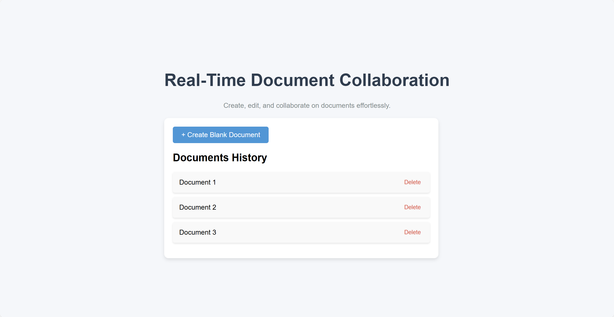
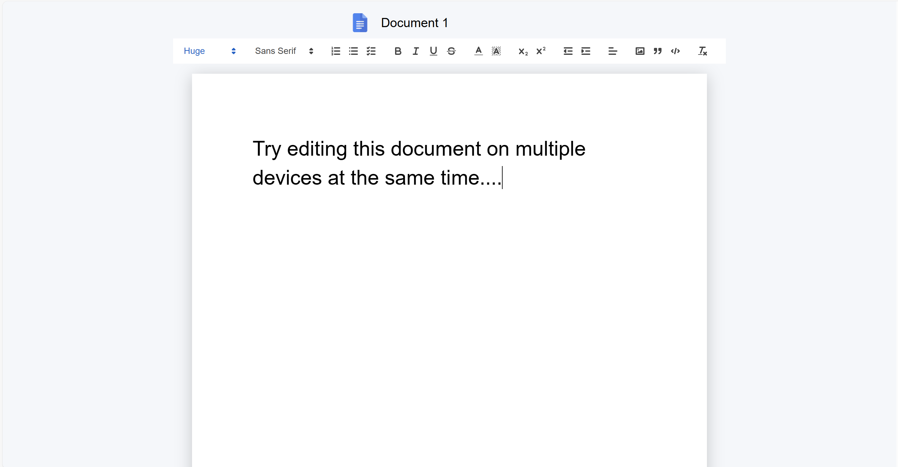
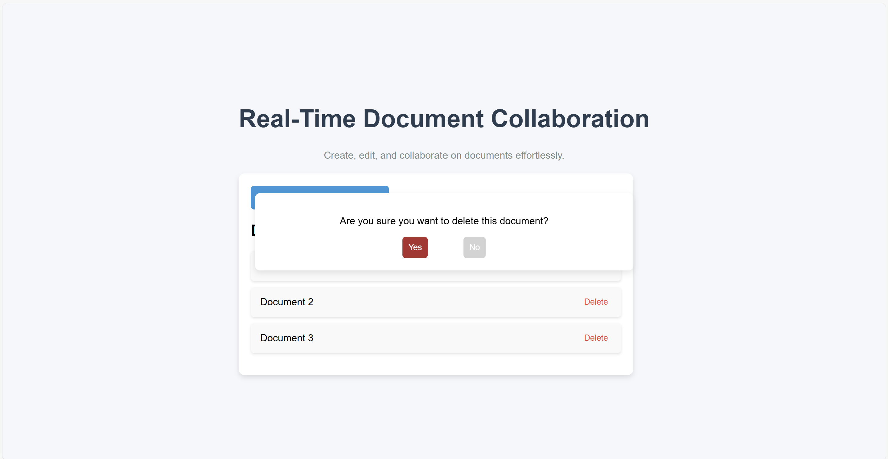

# Easy Docs

A **real-time collaborative text editor** built with modern web technologies to facilitate seamless document collaboration. This application allows users to create, edit, rename, and delete documents while providing a robust real-time editing experience. Designed with usability and performance in mind, it leverages advanced tools for document persistence and conflict resolution.

---

[**Live Demo**](https://easy-docs-tau.vercel.app/)  
Check out the live version of the application!

---

## **Key Features**

### 1. **Dashboard as Entry Point**
   - The dashboard serves as the application's central hub, listing all previously created documents by their titles.
   - Users can:
     - **Create** a new document.
     - **Edit** existing documents.
     - **Delete** any document.
     
     
     

### 2. **Unique Document URLs**
   - Each document is assigned a unique UUID (Universally Unique Identifier) upon creation.
   - The UUID becomes part of the document's URL, ensuring easy sharing and access.

### 3. **Real-Time Collaboration**
   - Multiple users can edit the same document simultaneously.
   - Changes are synchronized in real-time using **Socket.IO** for seamless collaboration.
     

https://github.com/user-attachments/assets/9b295f95-253b-4b85-99ab-314ef568fae5


### 4. **Document Persistence**
   - Documents are stored in **MongoDB**, ensuring data is saved and retrieved efficiently.
   - Even after refreshing the page or exiting the application, your data remains intact.

### 5. **Text Editor Features**
   - Powered by **Quill**, a rich text editor that uses "Deltas" for handling document changes.
   - Deltas provide efficient conflict resolution for concurrent edits.

### 6. **Feedback and User Experience**
   - Provides user-friendly feedback, including:
     - "Loading document contents..." when a document is being fetched.
     - "Rename successful" when a document title is updated.
   - Smooth navigation with **React Router**.

### 7. **Renaming Documents**
   - Document titles can be renamed directly from the editing page.
   - Updated titles are reflected immediately on the dashboard.

---

## **Technology Stack**

### **Frontend**
- **Vite + React**: A fast and modern development framework for building the user interface.
- **React Router**: Enables seamless client-side navigation.
- **Quill**: Provides a rich and customizable text editing experience.

### **Backend**
- **Node.js**: Handles server-side operations and API endpoints.
- **Socket.IO**: Powers real-time, bidirectional communication between the client and server.

### **Database**
- **MongoDB**: Ensures persistent storage and retrieval of document data.

---

## **How It Works**

1. **Creating a New Document**:
   - From the dashboard, click "Create New Document."
   - A new document is generated with a unique UUID and opened for editing.

2. **Editing a Document**:
   - Open any document from the dashboard.
   - Make edits in real-time, which are immediately reflected for all collaborators.

3. **Renaming a Document**:
   - Update the title on the document editing page.
   - Changes are saved and reflected on the dashboard with success feedback.

4. **Deleting a Document**:
   - Remove a document directly from the dashboard.

---

## **Setup and Installation**

### Prerequisites
- **Node.js** (v14 or higher)
- **MongoDB**
- **NPM** or **Yarn**

### Steps

1. **Clone the Repository**:
   ```bash
   git clone https://github.com/DharamveerSinghGrewal/easy-docs.git
   cd EasyDocs
   ```

2. **Install Dependencies**:
   - For the client:
     ```bash
     cd client
     npm install
     ```
   - For the server:
     ```bash
     cd server
     npm install
     ```

3. **Set Up Environment Variables**:
   - Create a `.env` file in the `server` folder with the following:
     ```env
     MONGO_URI=your_mongodb_connection_string
     FRONTEND_URL=http://localhost:3000
     ```

4. **Run the Application**:
   - Start the backend:
     ```bash
     cd server
     npm start
     ```
   - Start the frontend:
     ```bash
     cd client
     npm run dev
     ```

5. **Access the Application**:
   - Open the app in your browser at `http://localhost:3000`.

---

## **Future Enhancements**
- **User Authentication**: Secure user-specific documents with login functionality.
- **Version Control**: Maintain a history of edits for rollback and tracking.
- **Real-Time Presence Indicators**: Show active collaborators in a document.

---


## **Acknowledgments**
- **Quill** for its robust and customizable rich-text editing experience.
- **Socket.IO** for enabling real-time collaboration.
- **MongoDB** for its reliable data persistence.

